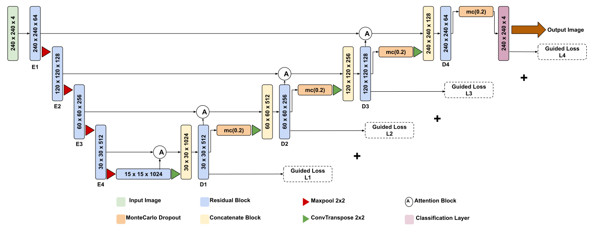

# Kidney Tumor Segmentation with Uncertainty Quantification

## Overview
This repository contains the implementation of an uncertainty-aware kidney tumor segmentation model using an Attention Residual U-Net with Guided Decoder (ARU-GD) and Monte Carlo Dropout on the KiTS23 dataset. The pipeline produces multi-class segmentation masks and predictive entropy uncertainty maps.

## Features
- Multi-class segmentation
- Background / Kidney / Tumor / Cyst
- Guided Decoder supervision
- Attention Gates
- Predictive entropy uncertainty maps
- Monte Carlo inference
- KiTS23 dataset

## Model Architecture


The model uses a residual encoder with attention gates in the decoder. Guided supervision is applied at multiple decoder depths, and Monte Carlo Dropout is used at inference to estimate predictive uncertainty via entropy.

## Dataset
KiTS23 dataset

## Repository Structure
```
.
├── assets/
│   └── architecture.svg
├── paper.pdf
├── predict.py
├── train.py
├── requirements.txt
├── .gitignore
└── README.md
```

## Installation
```
pip install -r requirements.txt
```

## Training
```
python train.py
```

## Prediction
```
python predict.py
```

## Results
| Class | Dice | IoU |
|-------|------|-----|
| Kidney | 0.8370 | 0.7760 |
| Tumor | 0.6914 | 0.6651 |
| Cyst | 0.8235 | 0.8130 |

Mean foreground Dice = 0.831  
Mean foreground IoU = 0.8129

## Research Paper
See `paper.pdf`.

## Future Work
- 3D extension
- Better uncertainty calibration
- Transformer integration
